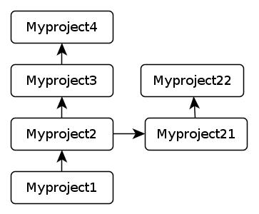

!SLIDE center
## Git, the fast version control system   

!SLIDE center
## Just a show-it-off talk   
### about WHAT not HOW
!SLIDE center
## what git can do for me?
 - help us keep the clue of our dev
 - backup our data (with github)
 - share code with people
   - let people knows about our project( nice for resume)
   - help collaboration ( most importantly)
!SLIDE center
## what is a project?
!SLIDE center
## A dir with subdir and files in it

!SLIDE center
## what is "Version Control"?
!SLIDE center
# cp -r
!SLIDE center

!SLIDE center
## So what is Git?
!SLIDE center
## And somebody even says:
## git is the next unix
<http://www.advogato.org/person/apenwarr/diary/371.html>
!SLIDE center
## What git can do for me?
!SLIDE center
## version control
time machine, allow you to make mistakes
## date backup
no more rsync
## integrity verification
no more md5sum
## data sharing
git clone
!SLIDE center
## Real case
Why Peter (me) like git so much?
## share data with students
save whole lot of typing for my students.
## backup all my code and docs
Github is awesome. Social coding.
## revisions via tig
really neat
!SLIDE center
## But, there are other vcs tools there? 
## Yes, but Git is the best.
## <http://whygitisbetterthanx.com/>
